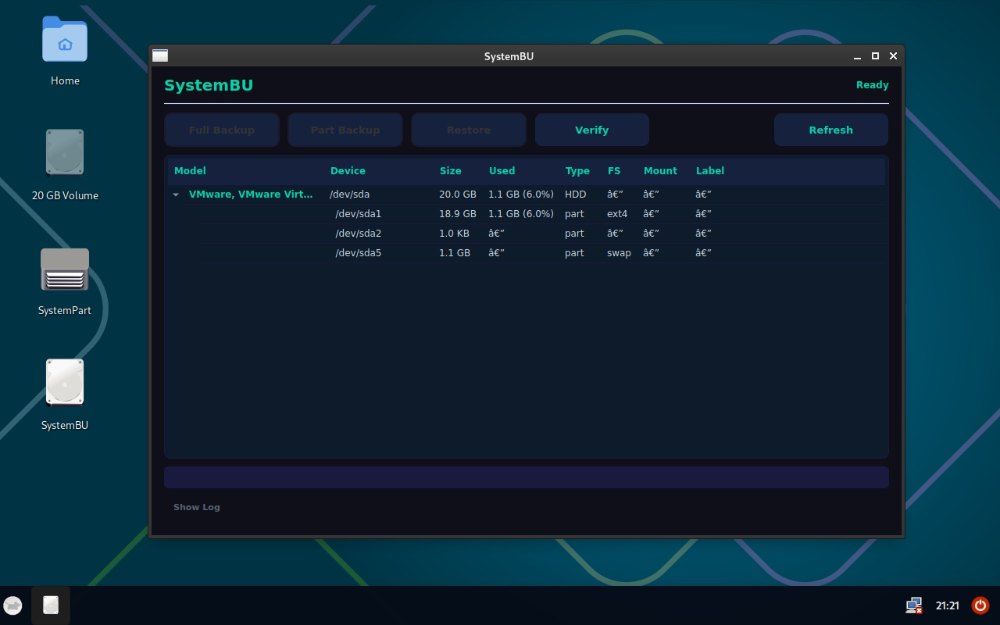

# SystemBU ISO Creator

SystemBU ISO Creator builds a Debian amd64 live ISO with a lightweight XFCE desktop, a quiet boot experience, and two bundled desktop tools:



- `SystemBU` for disk and partition backup/restore
- `SystemPart` for basic partition management

The tools are packaged as local `.deb` files during the build and are added to the ISO with desktop and start menu launchers.

## Project Layout

- `systembu_iso_creator_debian.py` - standalone Debian CLI builder
- `systembu_iso_creator_wsl.pyw` - Windows/WSL builder with GUI and CLI mode
- `build/systembu_desktop_setup.sh` - live system desktop and boot setup
- `tools/systembu.py` - backup and restore application
- `tools/systempart.py` - partition utility
- `tools/requirements.txt` - Python package requirements for the tools

## What The ISO Includes

- Debian `trixie` live system
- XFCE desktop
- LightDM autologin setup
- Plymouth splash and quiet boot settings
- Desktop and start menu launchers for `SystemBU` and `SystemPart`
- Local `.deb` packaging for both Python tools

## Dependencies

### Tool dependencies

Python requirements:

- `PySide6`
- `cryptography` for encrypted backups

SystemBU also relies on common Linux system tools such as `util-linux`, `parted`, `partclone`, `e2fsprogs`, and `ntfs-3g`.

SystemPart relies on `parted`, `util-linux`, `e2fsprogs`, `dosfstools`, and `ntfs-3g`.

Both GUI tools are intended to run as `root` on Linux.

### Build dependencies

The builders can auto-install the required host packages when needed. The main build requirements are:

- `live-build`
- `debootstrap`
- `squashfs-tools`
- `xorriso`
- `grub-pc-bin`
- `grub-efi-amd64-bin`
- `mtools`
- `dosfstools`

## Building

### Debian shell

Run directly inside a Debian environment:

```bash
sudo python3 systembu_iso_creator_debian.py
```

Useful options:

```bash
python3 systembu_iso_creator_debian.py --help
```

### Windows / WSL

Start the GUI:

```bash
python systembu_iso_creator_wsl.pyw
```

Or run headless:

```bash
python systembu_iso_creator_wsl.pyw --cli
```

The WSL builder is designed for a Debian WSL distro and can also auto-install missing host packages.

## Output

The generated ISO is written to the project root as:

```text
systembu-amd64.iso
```
